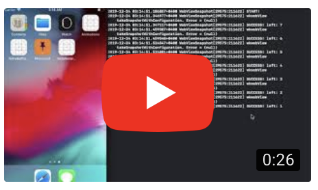
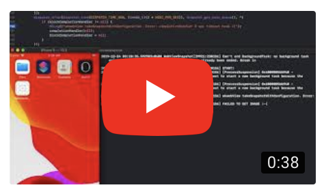

# WebView-Snapshot
WKWebView and UIWebView snapshot completely

#Tests

|iOS Version|UIWebView-Foreground|UIWebView-Background|WKWebView-Foreground|WKWebView-Background|
|---|---|---|---|---|
|iOS 12|+|+|+|+|
|iOS 13|+|+|+|-|
|iOS 13.1|+|+|+|-|
|iOS 13.2|+|+|+|-|
|iOS 13.3|+|+|+|-|

⚠️ Since iOS 13 WKWebView-Background snapshot is broken. Do you know how it can be fixed? Please, notify me.

<table>
<tr>
<td></td>
<td></td>
</tr>
</table>